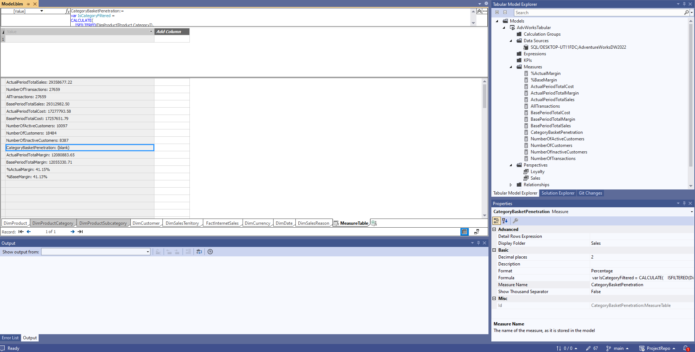
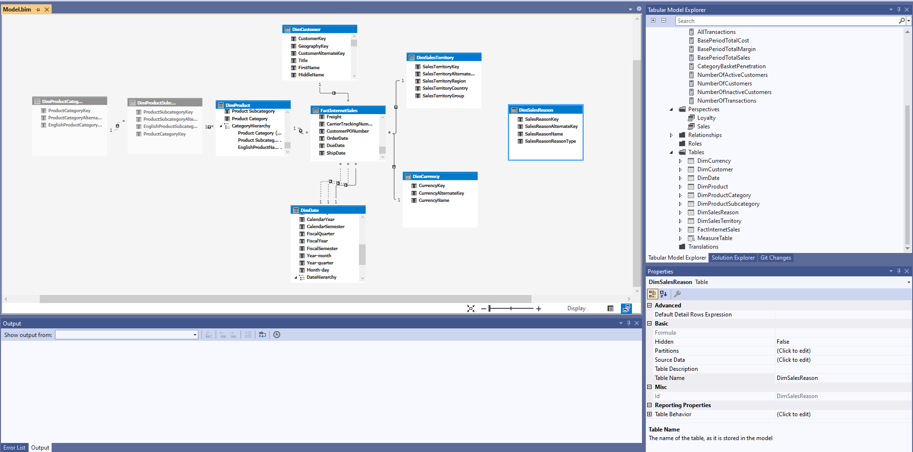
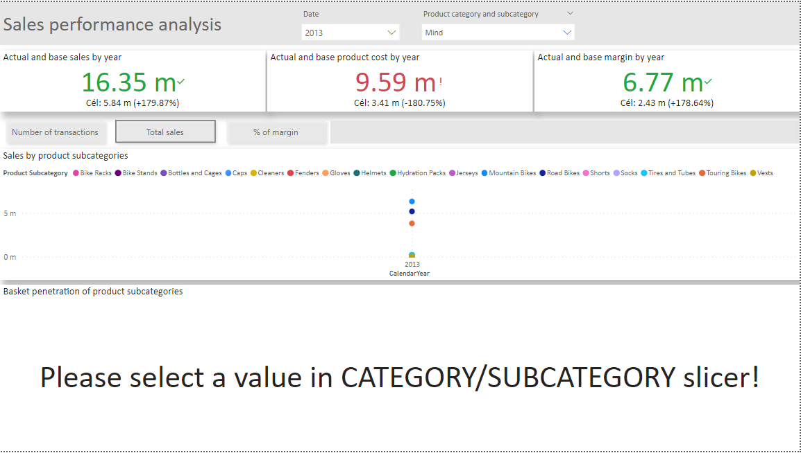
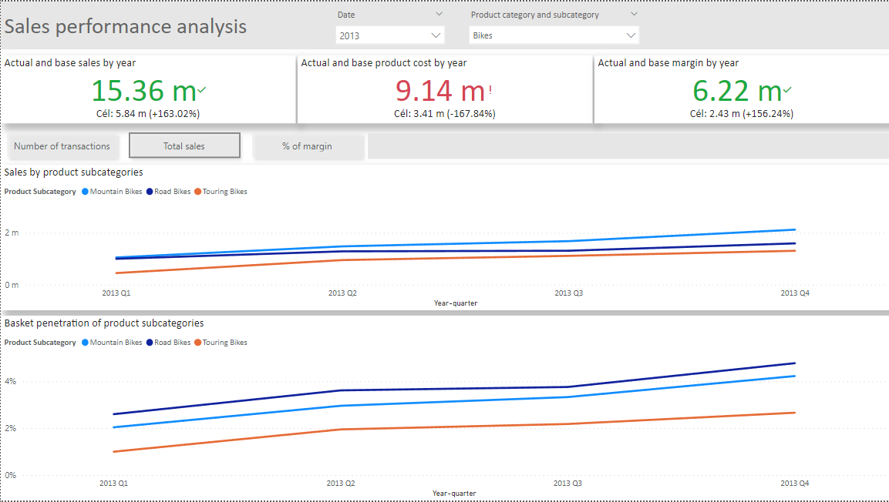
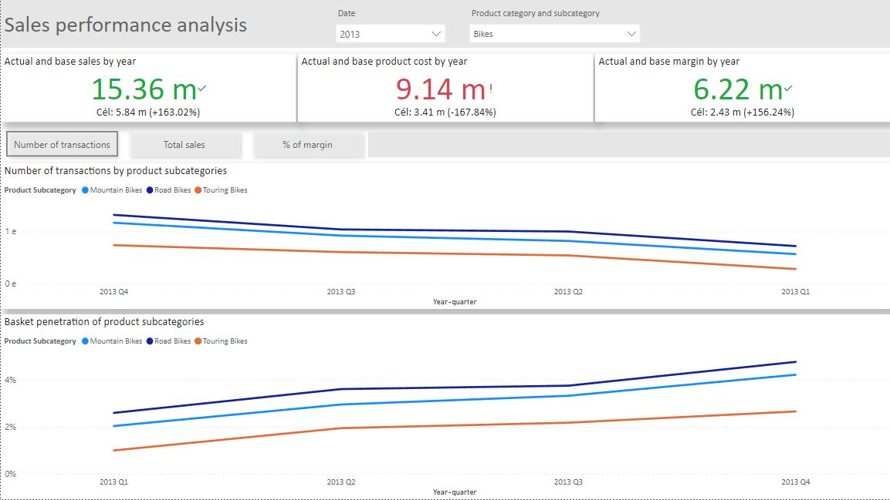
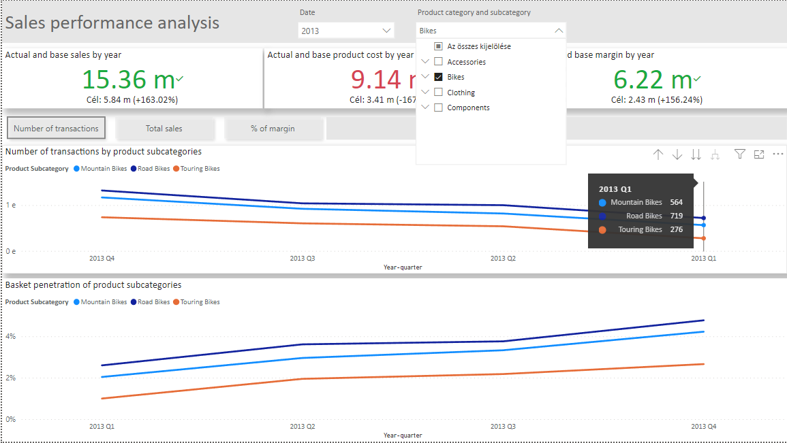

# SSASPractice
Skill development through online courses. The data source is the Adventure Works datawarehouse provided by Microsoft.
Topics included: setting up the SSDT and db/analysis services environments, tabular and multi-dimensional modeling, cube and measure development, MDX queries, creating views, dimension and table development, and deployment.
Pruned tables to contain only relevant data, created data and product category/subcategory hierarchies, developed sales and loyalty perspectives for different business needs, developed DAX measures (e.g.: Basket penetration, Number of active/inactive users, Actual/base period sales/margin/cost…), implemented measure table for measure grouping.

